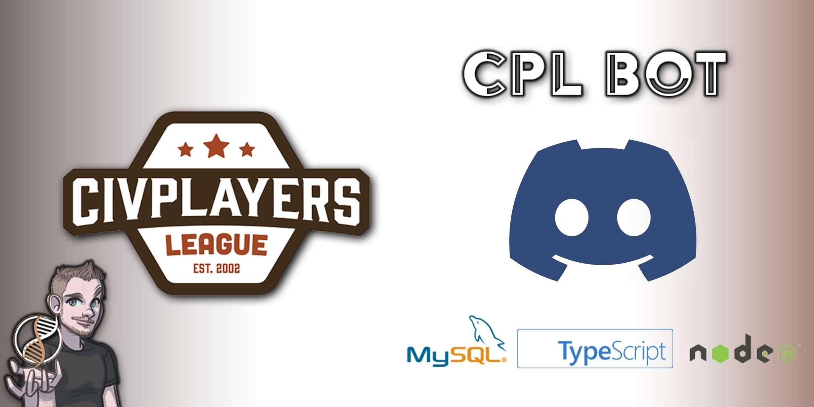

# CiscoBot-v2

Bot for Civilization Players League «CPL». Developed on Node.js/TypeScript.  

MySQL, Express, Discord API, Steam Web-API, Epic Web-APi, TrueSkill 

# Features
Civilizations draft systeam:
FFA
Teamers
Blind/Monkey
Dynamic 9 3 1
All Random

TrueSkill ranking system:
Player statistics 

Connection to user's games:
Lobby link generation & host rules

Dynamic leaderboard:
HoF
Seasons 

Miscellaneous functions:
Get random number
Coin flip

# Moderation Features
Punishment system
Registration system
Utility

# Installation

# Special thanks <3